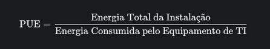
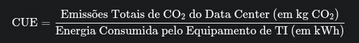
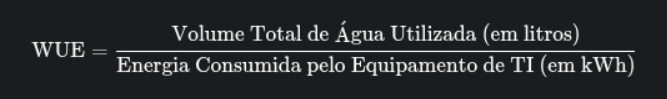
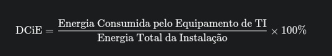

# Calculadora Verde #


---

# 📚 Sumário
1. [Apresentação do Projeto](#apresentação-do-projeto)
2. [Métricas Utilizadas](#métricas-utilizadas)
   - [PUE](#1-power-usage-effectiveness-pue)  
   - [CUE](#2-carbon-usage-effectivenes-cue)
   - [WUE](#3-water-usage-effectiveness-wue)
   - [DCIE](#4-data-center-infrastructure-efficiency-dcie)  
3. [Arquitetura do Projeto](#arquitetura-do-projeto)  
4. [Descrição dos Componentes](#descrição-dos-componentes)  
5. [Como Rodar o Projeto](#como-rodar-o-projeto)  
6. [Alunos Participantes](#alunos-participantes)

---

## Apresentação do Projeto
Com o aumento das necessidades tecnológicas de infraestrutura para diversos setores da computação como: inteligência artificial, big data e computação em nuvem, observa-se um aumento na demanda por capacidade física de alocação de recursos.

Esse crescimento potencializa o uso de data centers cada vez mais poderosos, esse fator intensifica o consumo energético e hídrico desses centros, contribuindo para a ineficiência na utilização de energia e água.

Dessa forma, a Calculadora Verde é a proposta de projeto final da matéria da Algoritmo e Programção de Computadores da Universidade de Brasília, desenvolvida pelos alunos do curso de Computação turma CIC004 e tem como objetivo faciliar o cálculo do consumo energético de data centers e prover uma visualização facilitada das métricas.

---
## Métricas utilizadas

### 1. Power Usage Effectiveness (PUE)
É a métrica utlizada para calcular a média eficiência energética de um Data Center. É obtida pela razão entre a energia total que entra no Data Center e a energia consumida pelos equipamentos de TI (kWh)



### 2. Carbon Usage Effectivenes (CUE)
É a métrica que mede as emissões de dióxido de carbono relacionada à energia consumida. É obtida pela razão entre as emisssões de CO<sub>2</sub> do data center e a energia consumida pelos equipamentos de TI (kWh)



Para calcular as emissões totais de CO<sub>2</sub> do data center é necessário multiplicar o consumo de energia elétrica pelo fator de emissão de carbono da fonte energética do local.
#### Fatores de Emissão 
- Hidroelétrica: ~0,05 Kg CO<sub>2</sub> /kWh
- Gás Natural: ~0,45 Kg CO<sub>2</sub> /kWh
- Carvão: ~0,9 Kg CO<sub>2</sub> /kWh

### 3. Water Usage Effectiveness (WUE)
É a métrica que quantifica o uso de água do data center. É resultado da razão entre o volume anual utilizado pelo data center e a energia consumida pelos equipamentos de TI (kWh)



### 4. Data Center Infrastructure Efficiency (DCIE)
É a porcentagem da energia total que está sendo consumida pela carga de TI, ou seja, é o inverso do PUE.




---

# Arquitetura do Projeto

A aplicação foi construída em **Flask** seguindo uma estrutura simples, organizada e adequada para projetos web iniciantes. Abaixo está a explicação de cada parte da arquitetura:

```
CALCULADORA-VERDE/
│
├── static/
│   ├── css/
│   │   └── homepage.css          # Estilos da interface
│   ├── img/                      # Imagens e ícones do projeto
│   │   ├── CUE.png
│   │   ├── PUE.png
│   │   ├── WUE.png
│   │   ├── dcie1.png
│   │   ├── dcie2.png
│   │   ├── medidores.svg / .png  # Imagens dos medidores visuais
│   │   └── ...
│
├── templates/
│   ├── homepage.html             # Apresenta todos os datacenters cadastrado e a média deles
│   ├── datacenter.html           # Apresenta os detalhes de um datacenter em específico
│   └── metricas.html             # Apresenta explicação sobre as métricas
│
├── calculador.py                 # Funções de cálculo das métricas
├── db_service.py                 # Manipulação do arquivo JSON de datacenters
├── datacenters.json              # Banco de dados local simples feito em JSON
├── index.py                      # App Flask (rotas e servidor)
├── .gitignore                    # Arquivos ignorados pelo Git
└── README.md                     # Documentação do projeto
```
---

# Descrição dos Componentes

### **1. index.py**
Arquivo principal da aplicação Flask.  
Responsável por:
- Inicializar o servidor  
- Definir rotas (`/`, `/datacenter/{id}`, `/metricas`, etc.)  
- Renderizar templates  
- Funções auxiliares para calcular o ângulo dos indicadores nos templates

---

### **2. calculador.py**
Contém toda a lógica de cálculo das métricas:
- PUE  
- CUE  
- WUE  
- DCIE  

Mantém o código organizado, isolando a lógica da camada web.

---

### **3. db_service.py**
Realiza operações com o arquivo `datacenters.json`, como:
- Adicionar datacenters
- Listar datacenters 
- Deletar datacenters

---

### **4. templates/**
Armazena as páginas HTML renderizadas pelo Flask:
- `homepage.html` → Apresentação dos datacenters e a média entre eles  
- `datacenter.html` → Apresentação de um datacenter individual e seus dados  
- `metricas.html` → Exibição das métricas usadas 

---

### **5. static/**
- CSS (estilo visual)
- Imagens (medidores, ícones, imagens do readme)

---

# Como Rodar o Projeto

## 1. Clone o repositório
```bash
git clone https://github.com/rafasversion/calculadora-verde.git
cd calculadora-verde
```

## 2. Crie um ambiente virtual
```bash
python3 -m venv venv
```

## 3. Ative o ambiente virtual
### Linux/Mac:
```bash
source venv/bin/activate
```

### Windows:
```bash
venv\Scripts\activate
```

## 4. Instale o Flask
```bash
pip install flask
```

## 5. Execute a aplicação
```bash
python index.py
```

## 6. Acesse no navegador
```
http://127.0.0.1:5000/
```

---

# Alunos Participantes

1. **Filipe Araújo da Silva** – 252011099  
2. **João Leonardo Sipauba Ferreira** – 252035733  
3. **Natália Teixeira Marques Rebouças** – 241032840  
4. **Rafaela Rodrigues dos Anjos** – 252038726  
5. **Ritalo Ruan Limados Santos** – 252011259  

---